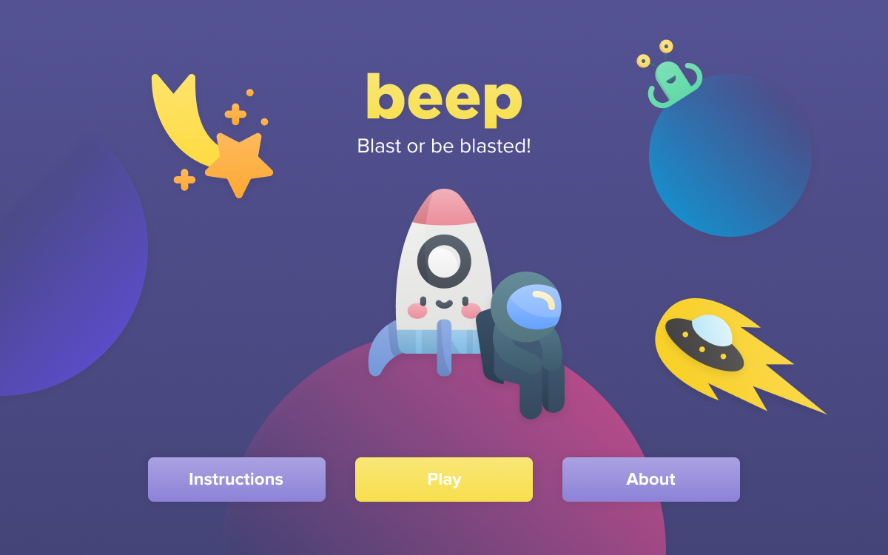
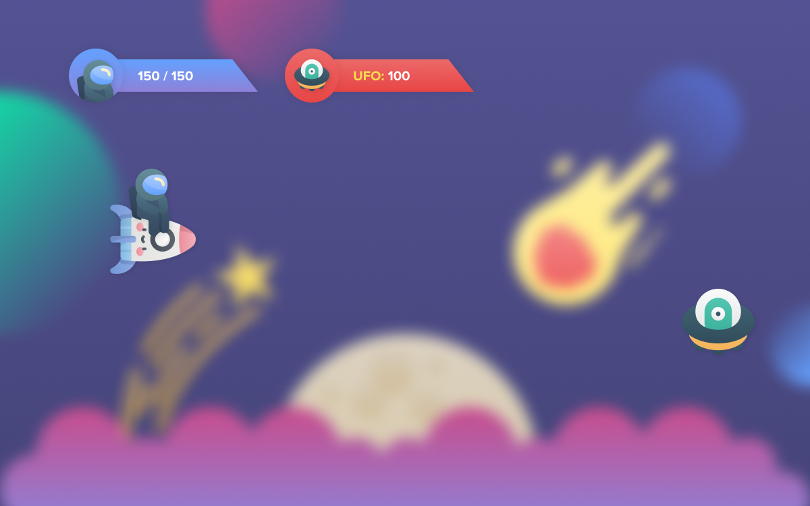
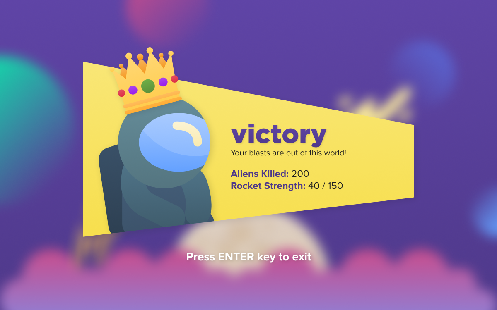

## beep 🚀
beep is a mini rocket-shooting game implemented on Java. *Blast stars towards pesky aliens to save your ship!* This is a project for **CMSC 22 (Object-oriented Programming).**

## Showcase 🌠

**Figure 1. Title Screen**

**Figure 2. Gameplay**

**Figure 3. Victory Screen**

## Prerequisite
To use the project, you need to install [**Eclipse.**](https://www.eclipse.org/downloads/)

## Installation
1. Import project in **Eclipse**.
2. Run **Main.java** in the **main** package.